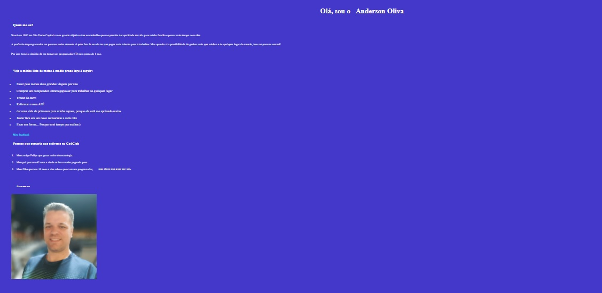

# primeiro-desafio-html-do-DevClub

> Desafio DevClub com as primeiras tags do html

## 🤝 Colaborador

<table>
  <tr>
      <a href="https://www.linkedin.com/in/anderson-oliva/">
         
        
          <a href= "https://www.linkedin.com/in/anderson-oliva/" >Anderson Oliva</a>
        
      </a>
    </td>
  </tr>
</table>